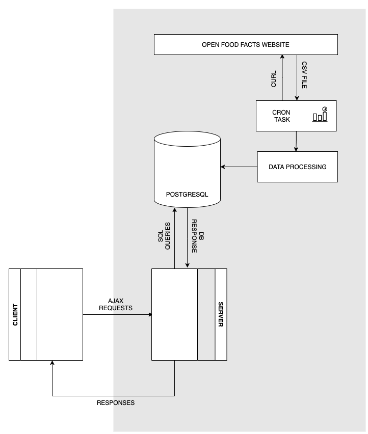

# PoC Nutrition

Table of index: <br>
&nbsp;&nbsp;&nbsp;&nbsp;&nbsp;&nbsp;[🔍 | Queries notebook](https://github.com/theoprovost/poc_nutrition/blob/Th%C3%A9o/notebooks/queries.ipynb) <br>
&nbsp;&nbsp;&nbsp;&nbsp;&nbsp;&nbsp;[🛠 | Data handling notebook](https://github.com/theoprovost/poc_nutrition/blob/Th%C3%A9o/notebooks/data_processing.ipynb) <br>
&nbsp;&nbsp;&nbsp;&nbsp;&nbsp;&nbsp;[📊 | EDA notebook](https://github.com/theoprovost/poc_nutrition/blob/Th%C3%A9o/notebooks/EDA.ipynb) <br><br>
&nbsp;&nbsp;&nbsp;&nbsp;&nbsp;&nbsp;[Project's context](#project) <br>
&nbsp;&nbsp;&nbsp;&nbsp;&nbsp;&nbsp;[🗺 | App tree map](#map) <br>
&nbsp;&nbsp;&nbsp;&nbsp;&nbsp;&nbsp;[🏗 | Architecture](#arch) <br>
&nbsp;&nbsp;&nbsp;&nbsp;&nbsp;&nbsp;[📖 | Methodological notes - Get started](#get_started) <br>
&nbsp;&nbsp;&nbsp;&nbsp;&nbsp;&nbsp;[🔁 | Automate data collection](#auto) <br>
&nbsp;&nbsp;&nbsp;&nbsp;&nbsp;&nbsp;[📺 | Presentation slides](https://slides.com/theoprvt/poc-nutrition/fullscreen) <br>

----
### Project's context <a name='project'></a>

> The main goal of this project is build an application idea. For this aim, we'll first need to analyze the required dataset to prove that the concept could work with our constraints.

### App tree map <a name='map'></a>
```shell
.
├── README.md
├── app
│   ├── backend
│   │   ├── controllers
│   │   │   ├── APIController.js
│   │   │   ├── chartsController.js
│   │   │   └── mainController.js
│   │   ├── database.js
│   │   ├── keys
│   │   │   ├── cert.pem
│   │   │   ├── key.pem
│   │   │   ├── keytmp.pem
│   │   │   └── redo.txt
│   │   ├── models
│   │   │   └── Record.js
│   │   ├── node_modules
│   │   ├── package-lock.json
│   │   ├── package.json
│   │   ├── router.js
│   │   └── server.js
│   └── frontend
│       ├── assets
│       │   ├── css
│       │   │   └── style.css
│       │   ├── icons
│       │   └── js
│       │       └── script.js
│       └── views
│           ├── chart.ejs
│           ├── charts.ejs
│           ├── index.ejs
│           └── partials
│               ├── charts
│               ├── footer.ejs
│               └── head.ejs
├── data
│   ├── en.openfoodfacts.org.products.csv
│   └── en.openfoodfacts.org.products_processed.csv
├── database
│   ├── create_db.sql
│   ├── create_table.sql
│   └── seed.sql
├── index.js
├── notebooks
│   ├── EDA.ipynb
│   ├── data_processing.ipynb
│   └── queries.ipynb
└── scripts
    ├── generate_charts.py
    ├── handle_data.py
    └── handle_data_params.json
```

### 🏗 | Architecture <a name='arch'></a>


------
### 📖 | Methodological notes - Get started <a name='get_started'></a>

> 💡 The app needs Node.js. Make sure you have the LTS version installed.

#### Installation of MVP :
```shell
git clone <project-url>
cd <project_path>/app/backend

npm install
```
#### Start the app :
```shell
node|nodemon index
```

#### App endpoints :
The base URL is : `https://localhost:8443/`
|Endpoint|Description|
|:--:|:--|
|/|Main page, scan products and get results|
|/charts|Charts index|
|/charts/:id|Chart of id|

----
#### Features 📦
- [x] Search a product by it's barcode (via a camera)
- [x] Choose from a selection of nutrition habits/recommendations/food intolerance to check if the product is compliant
- [x] Retrieve data from reworked [Open food Facts data](https://fr.openfoodfacts.org/)

#### Considered features for V.1.*
- [ ] Define custom limitations
- [ ] Store history and provide custom stats and charts about habits
- [ ] Collect user data to do meta-analyze

----
#### 🔁 | Automate data collection <a name='auto'></a>

As asked, the data could be updated on a regular basis without further manipulation. This feature could be enable via a cron task.

> ***Nota Bene*** <br>
> For now, everytime the `handle_data.py` script is executed, it truncates the table, process the data then insert a fresh new copy. For performance concerns and data integrity, this may be changed in a near future.

```shell
# Written for Macintosh
# Everyday, at 6AM, download csv, store it
0 6 * * * curl https://static.openfoodfacts.org/data/en.openfoodfacts.org.products.csv -o <path-to-folder-with-filename> && python <path-to-script>

# For instance
0 6 * * * curl https://static.openfoodfacts.org/data/en.openfoodfacts.org.products.csv -o /Users/theoprovost/Desktop/P11/data/en.openfoodfacts.org.products.csv  && python /Users/theoprovost/Desktop/P11/scripts/handle_data.py
```